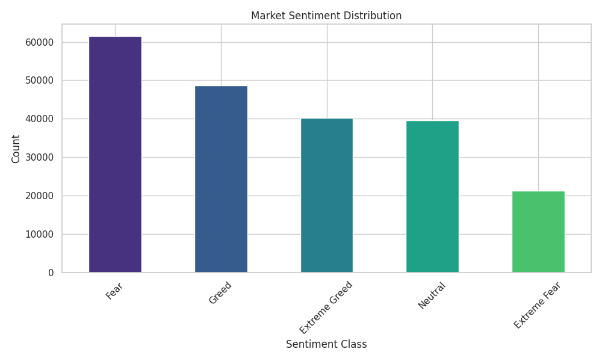
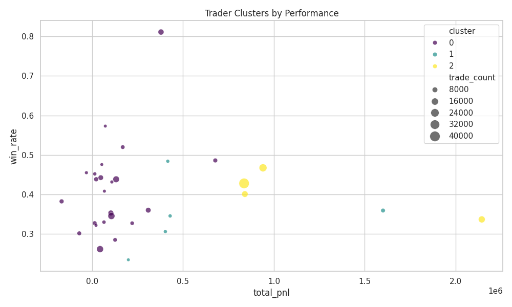

# Bitcoin Trading Analysis Project


##  Project Overview

This project explores the relationship between Bitcoin market sentiment (using the Fear & Greed Index) and trader performance on the Hyperliquid platform. The goal is to extract behavioral insights and develop data-driven strategies for trading optimization.

##  Tech Stack

* **Language**: Python 3.8+
* **Libraries**: Pandas, NumPy, Matplotlib, Seaborn, Scikit-learn
* **Data Sources**:

  * Hyperliquid trading data (211,224 trades)
  * Fear & Greed Index (2,644 daily records)

##  How to Run

1. Install dependencies:

   ```bash
   pip install -r requirements.txt
   ```
2. Ensure raw data files are placed in `data/raw/`
3. Run the full pipeline:

   ```bash
   python main.py
   ```

##  Sample Output

When you run `main.py`, you’ll see the following key stages:

```
=== Bitcoin Trading Analysis Project ===

1. Loading data...
Trader data loaded: (211224, 16)
Sentiment data loaded: (2644, 4)

2. Preprocessing and merging...
Final merged data shape: (211224, 22)

3. Calculating trader performance...
Analyzed 32 unique traders

4. Analyzing performance by sentiment...
- Extreme Greed Avg PnL: 65.08
- Neutral Avg PnL: 32.91

5. Correlation analysis and clustering...
Top correlation: Trade Size ↔ Fees (0.75)
Created 3 trader clusters

6. Visualizations and reporting...
Saved plots and report in `data/outputs/`

=== Analysis Complete! ===
```

##  Key Insights

###  Sentiment Performance Summary

| Sentiment     | Avg PnL | Win Rate | Avg Trade Value |
| ------------- | ------: | -------: | --------------: |
| Extreme Greed |   65.08 |    46.3% |      \$3,164.88 |
| Greed         |   50.12 |    39.3% |      \$5,537.64 |
| Neutral       |   32.91 |    36.2% |      \$4,846.49 |

> **Insight:** Trading during *Extreme Greed* phases significantly outperforms Neutral or Fear periods.

### 🔗 Top Correlations

| Feature Pair          | Correlation |
| --------------------- | ----------- |
| Trade Size ↔ Fees     | 0.75        |
| Trade Value ↔ PnL     | 0.12        |
| Sentiment Score ↔ PnL | 0.006       |


## Sample Visualizations




## Output Artifacts

* `data/processed/merged_data.csv` – Cleaned dataset
* `data/outputs/trader_metrics.csv` – Trader-wise performance metrics
* Visual reports: `.png` plots & `analysis_report.txt`
* Cluster and correlation analysis results

## Strategic Recommendations

* **Capitalize on “Extreme Greed”** periods — Avg PnL is highest
* **Caution in Neutral markets** — Lower profitability observed
* **Study Cluster 2** — Exhibits best performance behavior

## Future Enhancements

* Integrate real-time sentiment feeds
* Add on-chain activity metrics
* Train predictive models for trade outcomes


